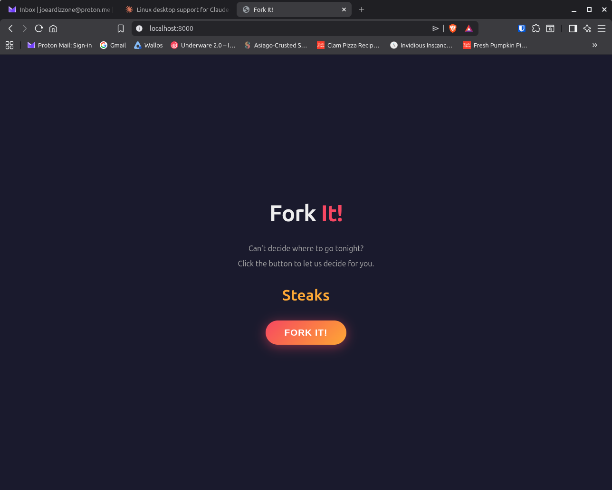

# Fork It!

Can't decide where to go tonight? Click the button to let us decide for you.



## Running locally

```bash
python3 -m venv .venv
source .venv/bin/activate
pip install -r requirements.txt
uvicorn main:app --reload
```

Then open [http://localhost:8000](http://localhost:8000) and click **Fork It!**

## API

```
GET /api/random
```

Returns a random food suggestion:

```json
{"food": "Tacos"}
```
